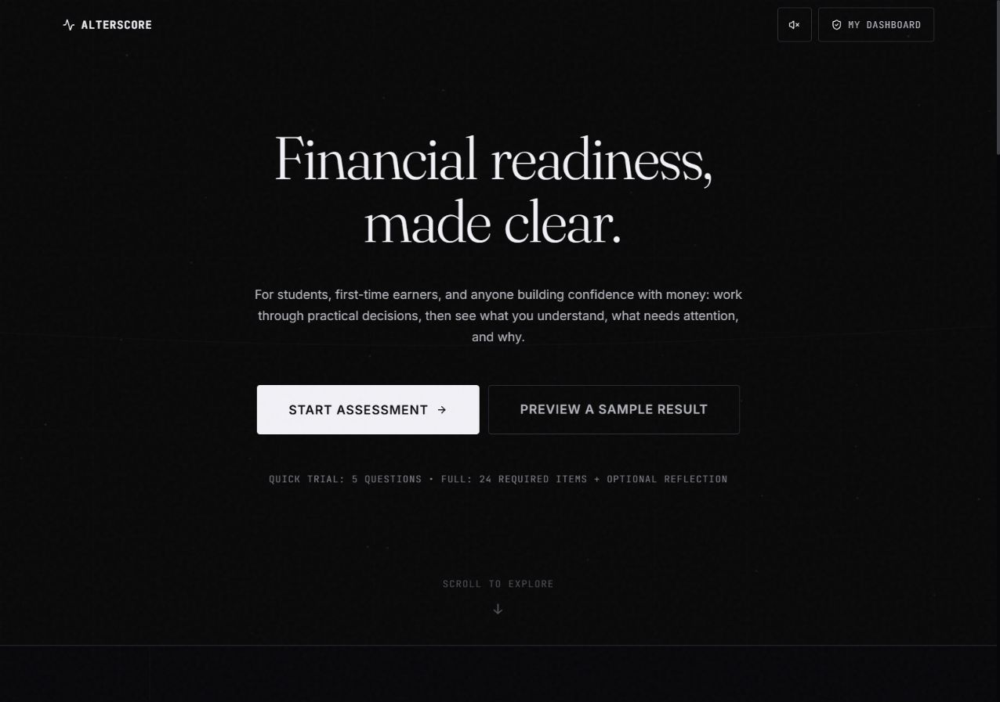
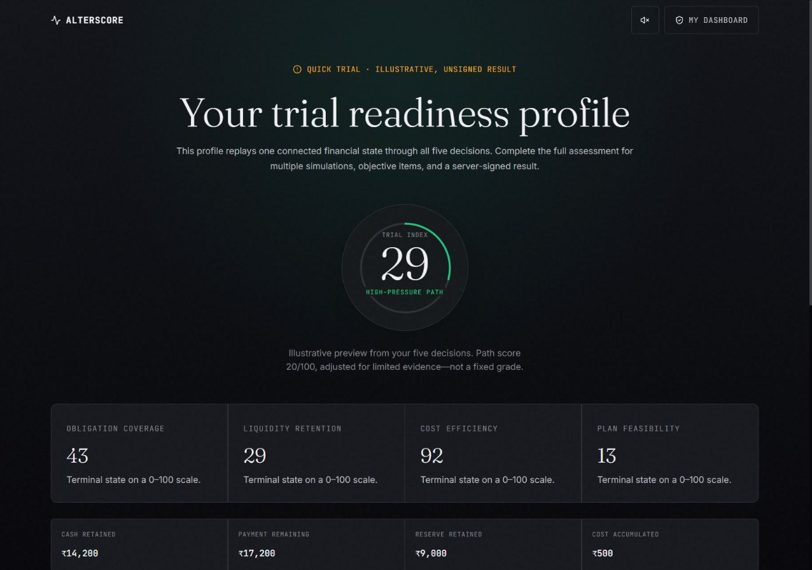
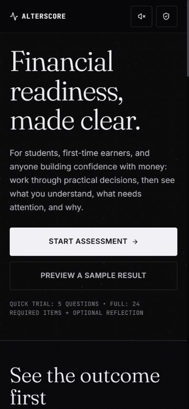

# AlterScore

AlterScore is a deterministic financial decision-readiness assessment. It helps people practise practical money decisions and see how a result was formed.

[](https://github.com/kaustubh-dot/AlterScore/actions/workflows/ci.yml)
[](https://alterscore.vercel.app/)

**[Open the live app](https://alterscore.vercel.app/)** · **[Take the quick trial](https://alterscore.vercel.app/assessment?mode=trial)** · **[Read the API contract](docs/API_CONTRACTS.md)**

<p align="center">
  
</p>

## What it does

AlterScore is aimed at students, first-time earners, and anyone who wants to practise financial decisions without submitting identity or credit information. The app keeps the scoring path narrow:

- practical calculations and judgement questions;
- branching scenarios where each choice changes the next state;
- a deterministic rubric with inspectable contributions;
- no lender, underwriting, approval, or creditworthiness decision.

The production scorer is ordinary Python code. It does not load machine-learning models, serialized model files, embeddings, or research artifacts at runtime.

## Two ways to try it

### Quick trial

The quick trial runs five questions in the browser and returns an immediate preview. It is labelled illustrative and unsigned, so it is useful for orientation rather than as an authoritative record.

### Full assessment

The full assessment is issued by the FastAPI service. The service validates opaque response IDs, consumes an attempt once, carries state through branching decisions, applies the deterministic rubric, and returns an explainable 0 to 100 Financial Decision Index. The public result is redacted and signed with HMAC-SHA256 so it can be verified without exposing scoring authority.

<p align="center">
  
</p>

The layout also adapts to narrow screens. This is the same landing page at a mobile viewport:

<p align="center">
  
</p>

## Assessment lifecycle

The assessment lifecycle is intentionally short and explicit:

<p align="center">
  
</p>

<p align="center"><a href="docs/diagrams/assessment-flow.html">Open the assessment-flow diagram source</a></p>

## Runtime boundaries

- The public v2 API is deterministic and does not depend on ML packages or model artifacts.
- Retired model-backed v1 routes return `410 Gone`; they are not part of the current scoring path.
- Answer keys and rubric logic stay on the server for the full assessment.
- Attempts and verification records are bounded in memory, so a restart can invalidate active tokens.
- The product does not collect accounts, identity documents, device fingerprints, credit history, or lender data.

The boundary is documented in [`docs/BACKEND_RUNTIME_ARCHITECTURE.md`](docs/BACKEND_RUNTIME_ARCHITECTURE.md), [`docs/DATA_SCHEMA.md`](docs/DATA_SCHEMA.md), and [`docs/API_CONTRACTS.md`](docs/API_CONTRACTS.md).

## Repository layout

| Area | Purpose |
| --- | --- |
| [`frontend/`](frontend/) | React 19 and Vite application, responsive UI, and browser contract tests |
| [`backend/app/`](backend/app/) | FastAPI application, v2 contracts, attempt lifecycle, and scoring |
| [`tests/`](tests/) | Backend unit and integration coverage |
| [`docs/`](docs/) | API, runtime, deployment, setup, and diagram documentation |
| [`scripts/ci/`](scripts/ci/) | Release packaging, smoke checks, and provenance validation |
| [`Dockerfile`](Dockerfile) | Allow-listed backend serving image for deployment |

## Run locally

Requirements: Python 3.12 and Node.js `20.19.x` or `>=22.12.0`.

```bash
# Terminal 1: backend
python -m venv venv
# Windows: venv\Scripts\activate
python -m pip install -r backend/requirements.txt
python -m uvicorn backend.app.main:app --reload --port 8000

# Terminal 2: frontend
cd frontend
npm install
npm run dev
```

Copy [`.env.example`](.env.example) to `.env` for local values. Set `ALTERSCORE_SIGNING_SECRET` to a generated base64url secret with at least 32 random bytes. Set `VITE_API_BASE_URL` when the API is not at `http://127.0.0.1:8000/api`.

## Validate changes

```bash
# Backend
python -m pip install -r backend/requirements-dev.txt
python -m pytest

# Frontend
cd frontend
npm run lint
npm run build
npm run test:phase5
npm run test:phase6
npm run test:phase7
npm run test:phase8
```

Production frontend builds require `VITE_RELEASE_SHA` to contain the exact reviewed 40-character Git SHA. CI also checks the API contract, explainability invariants, release boundaries, serving image, and paired deployment metadata.

## Deploy

The frontend is deployed to Vercel. The backend is a Docker Space on Hugging Face. Hugging Face does not need an ML model for this project: it runs the FastAPI container and its deterministic scorer. The release package intentionally excludes local data, research directories, and model artifacts.

The trusted workflow on `main` builds both sides from one SHA and publishes the backend package with [`scripts/ci/prepare_hf_release.py`](scripts/ci/prepare_hf_release.py). Configure these backend values in the hosting environment:

```text
ALTERSCORE_ENV=production
ALTERSCORE_API_VERSION=0.2.0
ALTERSCORE_RELEASE_SHA=<exact deployed commit>
ALTERSCORE_SIGNING_SECRET=<base64url secret with at least 32 random bytes>
ALTERSCORE_SIGNING_KEY_VERSION=<non-local key reference>
ALTERSCORE_CORS_ORIGINS=https://alterscore.vercel.app
```

See [`docs/SETUP.md`](docs/SETUP.md) for local configuration and [`docs/DEPLOYMENT.md`](docs/DEPLOYMENT.md) for the release, smoke-test, and rollback gates.

## Safety boundary

AlterScore is an educational demonstration. It is not a lender, credit bureau, underwriting system, repayment predictor, financial adviser, approval tool, or source of credit offers. Do not use it for lending, eligibility, pricing, approval, denial, or another high-impact financial decision.

## License

Released under the [MIT License](LICENSE).
