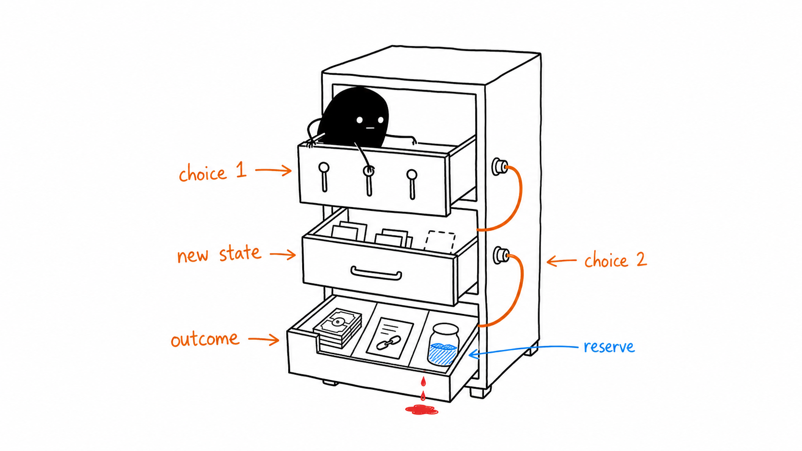

# AlterScore

> Financial decisions are hard to improve when the feedback is only a number. AlterScore shows the score, the evidence behind it, and the next useful step.

[](https://github.com/kaustubh-dot/AlterScore/actions/workflows/ci.yml)

**[Try the live demo](https://alterscore.vercel.app/)** · **[Preview a sample result](https://alterscore.vercel.app/#sample-result)** · **[Read the API contract](docs/API_CONTRACTS.md)**

AlterScore is an anonymous educational assessment for students, first-time earners, and anyone building confidence with money. It combines short financial calculations with branching real-world decisions, then returns a transparent 0–100 readiness index, worked evidence, and practical recommendations.

## Why it is different

- **Decisions have consequences.** Three-stage simulations carry financial state from one choice into the next.
- **The score explains itself.** Every domain, contribution, recommendation, and simulation replay can be inspected.
- **Trust is part of the product.** The server owns the rubric, consumes one-time attempts, and signs a redacted result that can be verified publicly.
- **The boundary is explicit.** AlterScore teaches; it never predicts repayment or makes a lending decision.

<p align="center">
  
  <br>
  <em>AlterScore scores financial knowledge and decisions—not identity or credit history.</em>
</p>

## Important boundaries

AlterScore is a demonstration, not a lender, credit bureau, underwriting tool, approval system, repayment predictor, financial product, or source of credit offers. It must not be used to make lending, creditworthiness, approval, denial, or other high-impact financial decisions.

The application does not use behavioral answers or the optional narrative to calculate a score. Historical labels, fairness reports, and model evaluation materials were synthetic; they are not external validation.

## What is included

- An anonymous v2 assessment with objective items, static judgment items, financial-state simulations, and unscored reflection prompts.
- A deterministic 0–100 Financial Decision Index with an illustrative 300–850 transform.
- A React frontend with explainable results and a session-only dashboard.
- A FastAPI backend with signed results, one-time bearer attempts, bounded in-memory verification, and HTTPS-only remote token transport.
- CI checks covering linting, contracts, release boundaries, backend tests, and the serving image.

## Built with Codex

AlterScore was built and hardened with Codex as an engineering collaborator. Codex helped inspect the repository, implement scoped frontend and backend changes, trace API contracts, review security boundaries, write focused tests, run end-to-end verification, and simplify patches before they shipped. The public score itself remains deterministic and auditable; Codex is part of the development workflow, not a hidden scoring dependency.

<p align="center">
  
  <br>
  <em>Each branching choice changes the financial state that the next decision inherits.</em>
</p>

## Architecture

```text
React assessment → FastAPI v2 API → deterministic scorer → signed, explainable result
```

| Area | Location |
| --- | --- |
| Public API, assessment instrument, and scorer | [`backend/app/`](backend/app/) |
| React assessment and results experience | [`frontend/`](frontend/) |
| Tests | [`tests/`](tests/) |
| API, deployment, rollback, and methodology docs | [`docs/`](docs/) |

<p align="center">
  
  <br>
  <em>A score arrives with its calculation, supporting evidence, and a practical next step.</em>
</p>

## Run locally

Requirements: Python 3.12 and Node.js `20.19.x` or `>=22.12.0`.

```bash
# Terminal 1: backend
python -m venv venv
# Windows: venv\Scripts\activate
python -m pip install -r backend/requirements.txt
python -m uvicorn backend.app.main:app --reload --port 8000

# Terminal 2: frontend
cd frontend
npm install
npm run dev
```

Set `ALTERSCORE_SIGNING_SECRET` to a generated base64url secret before using the assessment. The frontend uses `VITE_API_BASE_URL` to find the API; see the [frontend README](frontend/README.md) for the local override and production-build requirements.

## Verify changes

```bash
python -m pip install -r backend/requirements.txt
python -m pip install -r backend/requirements-dev.txt
python -m pytest tests/unit/backend tests/integration/api

cd frontend
npm run lint
npm run test:phase5
npm run test:phase6
npm run test:phase7
npm run test:phase8
```

For a production build, set `VITE_RELEASE_SHA` to the reviewed backend commit SHA before running `npm run build`. The [deployment guide](docs/DEPLOYMENT.md) and [rollback checklist](docs/ROLLBACK_CHECKLIST.md) describe the release process.

## Contributing

<p align="center">
  
  <br>
  <em>Reliable contributions fit code, tests, documentation, and review into one working whole.</em>
</p>

Contributions that improve clarity, accessibility, security, tests, documentation, and the assessment experience are welcome. Please read [CONTRIBUTING.md](CONTRIBUTING.md) before opening a pull request.

## License

AlterScore is available under the [MIT License](LICENSE).
