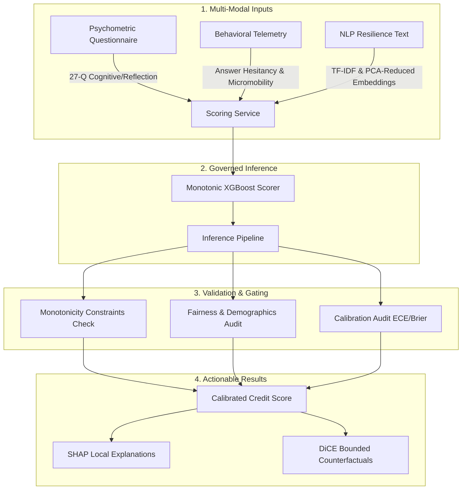

<div align="center">

# 📊 AlterScore — Governed Behavioral Credit Scoring

**An enterprise-grade, governed credit scoring platform that combines psychometric assessments, behavioral telemetry, and NLP-derived signals to safely score unbanked and thin-file borrowers.**

[](https://alterscore.vercel.app/)
[](https://huggingface.co/spaces/coolbot22/alterscore-backend)
[](https://github.com/kaustubh-dot/AlterScore/actions)
[](LICENSE)


</div>

---

## 💡 What is AlterScore?

Traditional credit scoring models systematically exclude thin-file, unbanked, and younger borrowers who lack a formal credit history. **AlterScore** bridges this gap by shifting the paradigm from *financial history* to *behavioral capability and psychometric profile*.

By securely and ethically evaluating an applicant's psychometric traits, cognitive reflection patterns, behavioral telemetry (micromobility metrics), and unstructured NLP-derived resilience cues, AlterScore outputs a robust, calibrated alternative risk score.

To satisfy the stringent compliance requirements of regulated financial lending, the platform enforces strict **governance checks** directly in its machine learning runtime:
1. **Monotonicity constraints** — Ensures that improving a positive credit attribute (e.g., higher financial literacy) strictly increases or maintains the credit score, preventing arbitrary fluctuations.
2. **Calibration review** — Constrains predictions to real-world default probabilities via Expected Calibration Error (ECE) monitoring.
3. **Fairness review** — Audits demographic parity and disparate impact across subgroups to prevent systemic bias.
4. **Counterfactual transparency** — Generates clear, actionable, and bounded recommendations for borrowers to improve their score.

---

## 🏗️ System Architecture & Data Pipeline

AlterScore ingests multi-modal input streams, maps them to a constrained feature space, executes governed inference, and returns explainable scoring metrics:



---

## 🌟 Core Features

### 1. Multi-Modal Credit Ingestion
* **Psychometric Battery:** Assesses 27 structured dimensions including numeracy, cognitive reflection (CRT), future orientation, conscientiousness, risk preference, reciprocity, loss aversion, and locus of control.
* **Behavioral Telemetry:** Audits interaction telemetry (average response time, scroll hesitation, answer change rate, typing speed, and session duration) to model applicant authenticity and flag automation/fraud.
* **NLP Resilience Signal:** Extracts semantic features from open-ended situational text prompts (e.g., Q27 text response) using TF-IDF vectorization and principal component analysis (PCA).

### 2. Calibrated Scorer & Explainability
* **Monotonic XGBoost:** A governed XGBoost model built with strict feature monotonicity constraints.
* **SHAP Explanations:** Instantly exposes the top positive and negative local factors contributing to each borrower's score.
* **DiCE Counterfactuals:** Generates optimal, actionable behavioral changes (e.g., *"increase numeracy score by 1 point"*) to help borrowers transition to higher score tiers.

### 3. Underwriter & Compliance Dashboard
* **Real-time Metrics:** Displays system-wide population calibration, drift indices, and AUC statistics.
* **Predictive Confusion Matrix:** Visualizes expected vs. actual default grids, displaying Accuracy, Precision, Recall, and F1 metrics for strict promotion gating.
* **Fairness & Drift Audit:** Monitors Population Stability Index (PSI) and subgroup fairness parity indicators (e.g., gender reviews) to maintain model hygiene.

---

## 📊 Current Production Model Registry Status

The checked-in production model is a manifest-backed, highly optimized **Monotonic XGBoost** runtime:

| Metric / Attribute | Value / Status | Description |
| :--- | :--- | :--- |
| **Runtime Model** | `xgboost_monotonic` | Governed monotonic tree architecture |
| **Manifest Version** | `xgboost_monotonic_v1` | Verified JSON-manifest production registry |
| **Model Registry Manifest** | `models/registry/production_manifest.json` | Hash-verified production manifest file |
| **Checked-in Test AUC** | **`0.8040`** | Robust classification power |
| **Checked-in Brier Score** | **`0.1514`** | Excellent probability calibration |
| **Checked-in ECE** | **`0.0284`** | Extremely low Expected Calibration Error |
| **Drift Verdict** | **`stable`** | No critical population drift detected |
| **Fairness Review** | `gender=non_binary flagged` | Under active pre-pilot audit and review |

*Note: The highly complex calibrated stacking ensemble remains committed in the repository as a baseline reference and instant hot-rollback target.*

---

## 🚀 Quickstart

Run both the backend and frontend services locally.

### Prerequisites
* Python `3.12.x`
* Node.js `18.x` or later

---

### 1. Backend Setup & Startup
Run these commands from the repository root directory:

```powershell
# 1. Create a Python 3.12 virtual environment
py -3.12 -m venv backend\.venv-cleanup

# 2. Activate the virtual environment
# Windows (PowerShell):
.\backend\.venv-cleanup\Scripts\Activate.ps1
# macOS/Linux (Bash):
source backend/.venv-cleanup/bin/activate

# 3. Upgrade pip and install core dependencies
python -m pip install --upgrade pip
python -m pip install -r backend\requirements.txt

# 4. (Optional) Install developer & test dependencies
python -m pip install -r backend\requirements-dev.txt

# 5. Start the FastAPI backend
python -m uvicorn backend.app.main:app --reload --host 127.0.0.1 --port 8000
```

* **Health Check URL:** `http://127.0.0.1:8000/api/health`
* **Interactive API Docs:** `http://127.0.0.1:8000/docs`

---

### 2. Frontend Setup & Startup
In a separate terminal, navigate to the frontend folder:

```powershell
# 1. Navigate to the frontend directory
cd frontend

# 2. Install NPM dependencies
npm install

# 3. Launch Vite development server
npm run dev -- --host 127.0.0.1 --port 5173
```

* **Frontend Local App:** `http://127.0.0.1:5173`

---

## 🧪 Validation & Verification

Ensure model health, reproducibility, and API contract compliance:

```powershell
# Run backend unit & ML pipeline test suite
backend\.venv-cleanup\Scripts\python.exe -m pytest tests\unit\ml\ -v

# Run runtime API smoke tests
backend\.venv-cleanup\Scripts\python.exe -m pytest tests\integration\api\test_checked_in_runtime_bundle_smoke.py -v

# Train and compare governed monotonic tree candidates
backend\.venv-cleanup\Scripts\python.exe scripts\train_monotonic_tree_candidates.py --row-count 10000

# Execute fairness hardening and review for XGBoost candidate
backend\.venv-cleanup\Scripts\python.exe scripts\fairness_harden_xgboost_candidate.py --row-count 10000
```

---

## 📂 Repository Guide

| Directory / File | Purpose |
| :--- | :--- |
| **`backend/`** | FastAPI server, validation layers, ML scoring, and local logging services. |
| **`frontend/`** | React + Vite single page application containing psychometrics assessment and evaluator views. |
| **`models/`** | Production manifest file (`production_manifest.json`), preprocess pipelines, and saved model binaries. |
| **`scripts/`** | Development setup scripts, offline model training pipelines, and reproducibility tools. |
| **`tests/`** | Pytest unit test coverage and high-fidelity integrated API smoke tests. |
| **`docs/`** | Exhaustive platform specifications, setup guides, and governance audit reports. |
| **`runtime/`** | Writable directory containing prediction audit trails and generated report charts. |
| **`archive/`** | Research history, older TabNet neural architectures, and early experimental notes. |

---

## 📄 Key Platform Documentation

For detailed analysis, refer to the documents in our `docs/` workspace:

* [docs/PROJECT_STRUCTURE.md](docs/PROJECT_STRUCTURE.md) — Structural map of files, directories, and data assets.
* [docs/GOVERNANCE_WORKFLOW.md](docs/GOVERNANCE_WORKFLOW.md) — Promotion requirements, mathematical constraints, and audit models.
* [docs/MODEL_SELECTION_DECISIONS.md](docs/MODEL_SELECTION_DECISIONS.md) — Auditable justification for monotonic tree selection over neural networks.
* [docs/governance/GOVERNED_PRODUCTION_ARCHITECTURE.md](docs/governance/GOVERNED_PRODUCTION_ARCHITECTURE.md) — Technical details of the checked-in manifest and scoring paths.
* [docs/VERCEL_DEPLOYMENT.md](docs/VERCEL_DEPLOYMENT.md) — Step-by-step runbook for high-performance frontend hosting.
* [docs/FREE_HOSTING_STRATEGY.md](docs/FREE_HOSTING_STRATEGY.md) — Practical strategies for hosting standard Python ML packages for free.
* [docs/SETUP.md](docs/SETUP.md) — Broad onboarding setup guides for developers.
* [docs/API_CONTRACTS.md](docs/API_CONTRACTS.md) — Comprehensive request and response JSON schema contracts.

---

## ⚖️ License

This project is licensed under the [MIT License](LICENSE).
