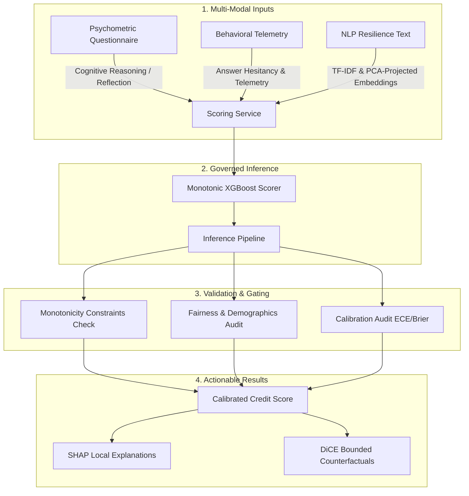

<div align="center">

# 📊 AlterScore — Governed Behavioral Credit Scoring

**An enterprise-grade, ethically governed alternative credit scoring platform that leverages psychometric assessments, rich behavioral telemetry, and NLP-derived resilience cues to safely score thin-file and unbanked borrowers.**

[](https://huggingface.co/spaces/coolbot22/alterscore-backend)
[](https://github.com/kaustubh-dot/AlterScore/actions)
[](LICENSE)


</div>

---

## 💡 Overview

Traditional underwriting algorithms systematically exclude thin-file, younger, and unbanked populations who lack formal credit histories. **AlterScore** bridges this gap by shifting the risk paradigm from *historical financial records* to *real-time behavioral capability and psychometric profile*.

By securely and ethically evaluating an applicant's cognitive reflection patterns, behavioral micromobility telemetry, and unstructured NLP-derived cues, AlterScore generates a robust, calibrated alternative risk score.

To satisfy the compliance requirements of regulated financial lending, the platform enforces strict **governance layers** directly in its machine learning runtime:
1. 📈 **Monotonicity constraints** — Guarantees that improving a positive credit attribute (e.g., higher financial literacy) strictly increases or maintains the credit score, preventing arbitrary scoring fluctuations.
2. 🎯 **Expected Calibration Error (ECE)** — Constrains model predictions to correspond directly with real-world repayment default probabilities.
3. ⚖️ **Subgroup Fairness Gates** — Audits demographic parity, disparate impact, and AUC gaps across subgroups to prevent systemic bias.
4. 💡 **Counterfactual Explanations** — Leverages DiCE to generate actionable, bounded behavioral recommendations to help borrowers transition to higher score tiers.

---

## 🏗️ System Architecture & Pipeline

AlterScore ingests multi-modal input streams, maps them to a constrained feature space, executes governed inference, and returns explainable, compliance-ready scoring metrics:



---

## 🌟 Core Features

### 🧠 1. Multi-Modal Credit Ingestion
* **Psychometric Battery:** Assesses structured dimensions including numeracy, cognitive reflection (CRT), future orientation, conscientiousness, risk preference, reciprocity, loss aversion, and locus of control.
* **Behavioral Telemetry:** Audits interaction micromobility (average response time, scroll hesitation, answer change rate, typing speed, and session duration) to model applicant pacing and flag automation/fraud.
* **NLP Resilience Cues:** Extracts semantic and agency features from open-ended situational text prompts using principal component analysis (PCA) text projections.

### 🛡️ 2. Calibrated Scorer & Explainability
* **Monotonic XGBoost:** A governed XGBoost model built with strict feature monotonicity constraints.
* **SHAP Explanations:** Instantly exposes the top positive and negative local factors contributing to each borrower's score.
* **DiCE Counterfactuals:** Generates optimal, actionable behavioral changes (e.g., *"increase numeracy score by 1 point"*) to help borrowers transition to higher score tiers.

### 📊 3. Underwriter & Compliance Dashboard
* **Real-time Metrics:** Displays system-wide population calibration, drift indices, and AUC statistics.
* **Predictive Confusion Matrix:** Visualizes expected vs. actual default grids, displaying Accuracy, Precision, Recall, F1, and ROC metrics.
* **Fairness & Drift Audit:** Monitors Population Stability Index (PSI) and subgroup fairness parity indicators (e.g., gender reviews) to maintain model hygiene.

---

## 📈 Model Registry Status

The active production model is a manifest-backed, highly optimized **Monotonic XGBoost** runtime:

| Metric / Attribute | Value / Status | Description |
| :--- | :--- | :--- |
| 🚀 **Runtime Model** | `xgboost_monotonic` | Governed monotonic tree classifier |
| 📦 **Manifest Version** | `xgboost_monotonic_calibrated_v1` | Verified JSON-manifest production registry |
| 📂 **Model Registry Manifest** | `models/registry/production_manifest.json` | Hash-verified production manifest file |
| 🎯 **Checked-in Test AUC** | **`0.7549`** | Temporal test split discrimination |
| 📐 **Checked-in Brier Score** | **`0.1903`** | Calibrated probability error on the test split |
| 🔍 **Checked-in ECE** | **`0.0353`** | Isotonic-calibrated probability reliability |
| 📊 **Drift Verdict** | **`watch`** | Non-blocking PSI watch on `avg_response_time_ms` |
| ⚖️ **Fairness Review** | **`passed`** | Blocking fairness gates pass; max similar-pair gap is 99 |

> [!NOTE]
> The highly complex calibrated stacking ensemble has been archived in the repository as a baseline reference and instant hot-rollback target.

---

## 🚀 Quickstart

Run the backend service locally.

### Prerequisites
* Python `3.12.x`

---

### Backend Setup & Startup
Run these commands from the repository root directory:

```powershell
# 1. Create a Python 3.12 virtual environment
py -3.12 -m venv venv

# 2. Activate the virtual environment
# Windows (PowerShell):
.\venv\Scripts\Activate.ps1
# macOS/Linux (Bash):
source venv/bin/activate

# 3. Upgrade pip and install core dependencies
python -m pip install --upgrade pip
python -m pip install -r backend/requirements.txt

# 4. (Optional) Install developer & test dependencies
python -m pip install -r backend/requirements-dev.txt

# 5. Start the FastAPI backend
python -m uvicorn backend.app.main:app --reload --host 127.0.0.1 --port 8000
```

* **Health Check URL:** `http://127.0.0.1:8000/api/health`
* **Interactive API Docs:** `http://127.0.0.1:8000/docs`

---

## 🧪 Validation & Verification

Ensure model health, reproducibility, and API contract compliance:

```powershell
# Run backend unit & ML pipeline test suite
.\venv\Scripts\pytest tests/unit/ -v

# Run automated behavioral persona regression suite & integration tests
.\venv\Scripts\pytest tests/unit tests/integration -m "not slow" -n 6 --basetemp=.runtime/pytest-temp

# Rebuild the calibrated monotonic runtime bundle with GPU XGBoost
.\venv\Scripts\python.exe scripts\training\train_calibrated_monotonic_xgboost.py --device cuda

# Evaluate manifest-backed promotion gates
.\venv\Scripts\python.exe -m backend.ml.registry.promotion_gates
```

---

## 📂 Repository Layout

| Directory / File | Purpose |
| :--- | :--- |
| **`backend/`** | FastAPI server, validation layers, ML scoring, and local logging services. |
| **`models/`** | Production manifest file (`production_manifest.json`), preprocess pipelines, and saved model binaries. |
| **`scripts/`** | Development setup scripts, environment initialization tools. |
| **`tests/`** | Pytest unit test coverage and high-fidelity integrated API smoke tests. |
| **`docs/`** | Consolidated specifications, setup guides, and governance audit reports. |
| **`archive/`** | Research history, older TabNet neural architectures, and early experimental notes/models. |

---

## 📄 Platform Specifications

For detailed architectural and regulatory analysis, refer to the documents in our `docs/` workspace:

* [docs/PROJECT_STRUCTURE.md](docs/PROJECT_STRUCTURE.md) — Structural map of files, directories, and data assets.
* [docs/GOVERNANCE_WORKFLOW.md](docs/GOVERNANCE_WORKFLOW.md) — Promotion requirements, mathematical constraints, and audit models.
* [docs/MODEL_SELECTION_DECISIONS.md](docs/MODEL_SELECTION_DECISIONS.md) — Auditable justification for monotonic tree selection over neural networks.
* [docs/API_CONTRACTS.md](docs/API_CONTRACTS.md) — Comprehensive request and response JSON schema contracts.
* [docs/FREE_HOSTING_STRATEGY.md](docs/FREE_HOSTING_STRATEGY.md) — Practical strategies for hosting standard Python ML packages for free.
* [docs/SETUP.md](docs/SETUP.md) — Broad onboarding setup guides for developers.

---

## ⚖️ License

This project is licensed under the [MIT License](LICENSE).
