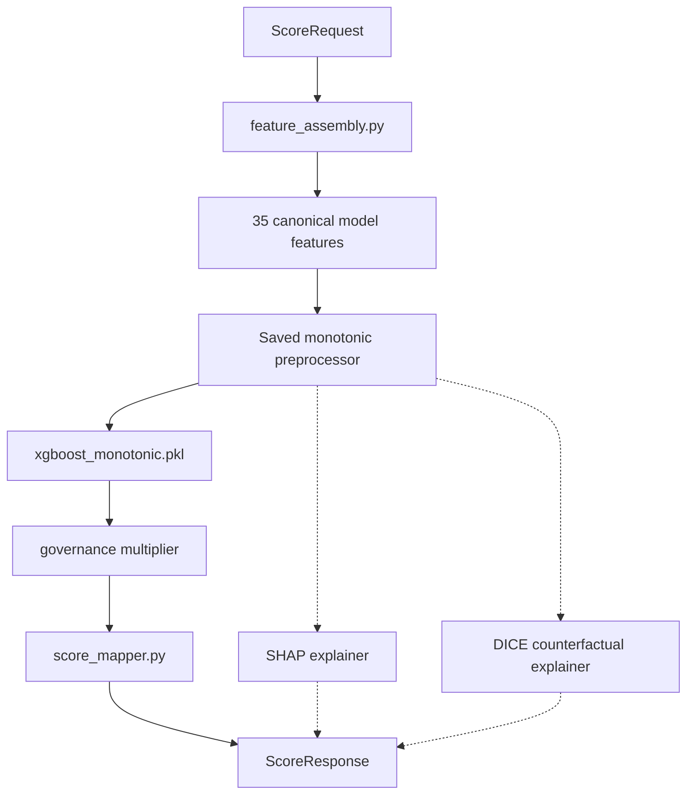

# Backend Runtime Architecture

This document explains the current backend architecture that frontend,
deployment, and ML engineers must understand before modifying runtime code.

## Active Runtime Model

`models/registry/production_manifest.json` points to `xgboost_monotonic`
(model version `0.3.0`) as the active runtime model. It is a single
monotonic constrained-tree scorer loaded from:

```text
models/artifacts/xgboost_monotonic.pkl
```

The calibrated stacking ensemble and its base models remain checked in as
benchmark and rollback/reference artifacts, but the default manifest no longer
loads the six-model ensemble path.

## Current Inference Path



## Key Components

- `backend/app/core/artifact_loader.py` loads the manifest, validates
  checksums, and resolves the active bundle.
- `backend/app/services/scoring.py` assembles features, transforms them through
  the saved preprocessor, predicts repayment probability, applies the bounded
  governance multiplier, maps to a credit score, and generates explanations and
  counterfactual actions.
- `backend/ml/training/classical/monotonic_constraints.py` defines the
  constrained-tree feature policy used by the promoted runtime.
- `backend/app/services/analytics.py` serves dashboard data from the
  manifest-declared report artifacts.

The ensemble adapter in `backend/ml/inference/ensemble_adapter.py` is still
available for manifests that declare `runtime_model_type: "ensemble"`, but it
is not used by the active manifest.

## Stable Systems

| System | Path | Why It Is Sensitive |
|---|---|---|
| Manifest loader | `backend/app/core/artifact_loader.py` | Checksum verification and runtime selection |
| Scoring service | `backend/app/services/scoring.py` | End-to-end score response construction |
| Feature assembly | `backend/ml/inference/feature_assembly.py` | Raw request to canonical feature row |
| Preprocessing pipeline | `backend/ml/preprocessing/pipeline.py` | Serialized artifacts depend on it |
| Feature registry | `backend/ml/preprocessing/feature_registry.py` | Canonical 35-feature contract |
| Analytics service | `backend/app/services/analytics.py` | Report-backed dashboard API |
| Health route | `backend/app/api/v1/routes/health.py` | Manifest-backed readiness reporting |
| Production manifest | `models/registry/production_manifest.json` | SHA256-verified runtime contract |

If you change any of these files, run the smallest relevant tests first, then
run the broader affected suite before finalizing. For model/artifact changes,
also run `python -m pytest tests/integration/api/test_checked_in_runtime_bundle_smoke.py`.

## Artifact Relationships

```text
production_manifest.json
  runtime_model              -> models/artifacts/xgboost_monotonic.pkl
  preprocessor               -> models/preprocessors/preprocessor_monotonic.pkl
  text_pca                   -> models/preprocessors/text_pca.pkl
  shap_explainer             -> models/explainers/shap_explainer_monotonic.pkl
  dice_explainer             -> models/explainers/dice_explainer_monotonic.pkl
  metrics                    -> models/reports/metrics_monotonic.json
  baseline_metrics           -> models/reports/baseline_metrics_monotonic.json
  fairness_report            -> models/reports/fairness_report_monotonic.json
  psi_report                 -> models/reports/psi_report_monotonic.json
  global_importance          -> models/reports/global_importance_monotonic.json
  population_percentiles     -> models/reports/population_percentiles_monotonic.json
```

At startup, the backend:

1. Loads settings.
2. Loads and parses the manifest.
3. Verifies artifact checksums.
4. Deserializes and validates each artifact.
5. Reports loaded, missing, and invalid artifacts in `/api/health`.

If a scoring-critical artifact fails validation, `/api/score` returns `503`.

## Explainability Dependencies

| Artifact | Purpose | Runtime Behavior |
|---|---|---|
| `shap_explainer_monotonic.pkl` | Per-user explanations | Optional; score still works with an empty explanation list |
| `dice_explainer_monotonic.pkl` | Counterfactual actions | Optional fallback exists, but the checked-in bundle includes it |
| `global_importance_monotonic.json` | Dashboard importance | Served by `/api/global-importance` |
| `fairness_report_monotonic.json` | Dashboard fairness | Served by `/api/fairness-report` |
| `psi_report_monotonic.json` | Dashboard drift | Served by `/api/drift-report` |

## Current Caveats

- The checked-in runtime report is the operational source of truth: held-out
  test AUC is `0.7596` before post-model governance and `0.7590` after the
  governance multiplier. Older governed-review figures such as `0.8040` and
  `0.8090` are historical experiment results from different candidate/report
  contexts.
- The fairness report includes subgroup metrics, calibration parity, a
  full-profile individual-fairness proxy, and post-governance subgroup impact.
- `production_manifest.json` still records a historical `code_ref` value and
  should be replaced with an explicit branch/commit identifier during the next
  formal promotion.

## Environment Constraints

| Component | Version | Notes |
|---|---|---|
| Python | `3.12.x` recommended | Python `3.10` is the syntax floor; Python `3.14.x` is not the recommended local setup path |
| scikit-learn | `>=1.8.0,<1.9.0` | Required by checked-in artifacts |
| XGBoost | `>=2.1.3,<2.2` | Required by the active monotonic runtime |
| PyTorch / pytorch-tabnet | Runtime dependencies | Still required while reference ensemble/TabNet artifacts remain loadable and tested |
| Node.js | `>=18 <25` | Frontend build |
| Vite | `6.0.5` | Frontend dev/build tooling |
| React | `18.3.1` | Frontend framework |

Do not upgrade backend or frontend dependencies without running the affected
test/build suite and updating the relevant docs.
