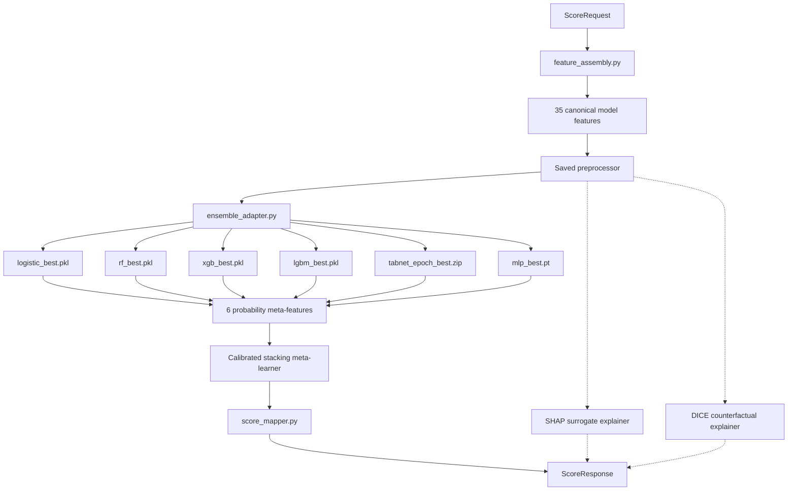

# Backend Runtime Architecture

This document explains the current backend architecture that frontend,
deployment, and ML engineers must understand before modifying runtime code.

## Active Runtime Model

`models/registry/production_manifest.json` points to `stacking_ensemble`
(v0.2.0) as the active runtime model. It is a calibrated stacking ensemble with
six base models:

| Base Model | Artifact | Inference Path |
|---|---|---|
| Logistic Regression | `logistic_best.pkl` | sklearn `predict_proba` |
| Random Forest | `rf_best.pkl` | sklearn `predict_proba` |
| XGBoost | `xgb_best.pkl` | sklearn `predict_proba` |
| LightGBM | `lgbm_best.pkl` | sklearn `predict_proba` |
| TabNet | `tabnet_epoch_best.zip` | pytorch-tabnet `predict_proba` |
| Residual MLP | `mlp_best.pt` | PyTorch forward pass |

The meta-learner is a logistic-regression stacker wrapped in isotonic
calibration.

## Ensemble Inference Path



## Key Components

- `backend/ml/inference/ensemble_adapter.py` orchestrates multi-model inference.
- `backend/app/core/artifact_loader.py` loads the manifest, validates checksums, and loads all ensemble dependencies.
- `backend/app/services/scoring.py` builds `EnsembleInferenceBundle` and routes repayment-probability prediction through the adapter.
- `WrappedEnsembleModel` exposes a standard `predict_proba(processed_35)` facade for DICE.

## Stable Systems

| System | Path | Why It Is Sensitive |
|---|---|---|
| Manifest loader | `backend/app/core/artifact_loader.py` | Checksum verification and ensemble loading |
| Ensemble adapter | `backend/ml/inference/ensemble_adapter.py` | Core production inference path |
| Scoring service | `backend/app/services/scoring.py` | End-to-end score response construction |
| Feature assembly | `backend/ml/inference/feature_assembly.py` | Raw request to canonical feature row |
| Preprocessing pipeline | `backend/ml/preprocessing/pipeline.py` | Serialized artifacts depend on it |
| Feature registry | `backend/ml/preprocessing/feature_registry.py` | Canonical 35-feature contract |
| Analytics service | `backend/app/services/analytics.py` | Report-backed dashboard API |
| Health route | `backend/app/api/v1/routes/health.py` | Manifest-backed readiness reporting |
| Production manifest | `models/registry/production_manifest.json` | SHA256-verified runtime contract |

If you change any of these files, run the smallest relevant tests first, then
run the broader affected suite before finalizing. For model/artifact changes,
also run `python -m pytest tests/integration/api/test_checked_in_runtime_bundle_smoke.py`.

## Artifact Relationships

```text
production_manifest.json
  runtime_model              -> models/artifacts/calibrated_stacking.pkl
  preprocessor               -> models/preprocessors/preprocessor.pkl
  text_pca                   -> models/preprocessors/text_pca.pkl
  shap_explainer             -> models/explainers/shap_explainer.pkl
  dice_explainer             -> models/explainers/dice_explainer.pkl
  metrics                    -> models/reports/metrics.json
  baseline_metrics           -> models/reports/baseline_metrics.json
  fairness_report            -> models/reports/fairness_report.json
  psi_report                 -> models/reports/psi_report.json
  global_importance          -> models/reports/global_importance.json
  population_percentiles     -> models/reports/population_percentiles.json
  base_models
    logistic_regression      -> models/artifacts/logistic_best.pkl
    random_forest            -> models/artifacts/rf_best.pkl
    xgboost                  -> models/artifacts/xgb_best.pkl
    lightgbm                 -> models/artifacts/lgbm_best.pkl
    tabnet                   -> models/artifacts/tabnet_epoch_best.zip
    residual_mlp             -> models/artifacts/mlp_best.pt
  stacking_config            -> models/artifacts/calibrated_stacking_config.json
```

At startup, the backend:

1. Loads and parses the manifest.
2. Verifies artifact checksums.
3. Deserializes and validates each artifact.
4. Loads all base models and stacking config for ensemble bundles.
5. Reports loaded, missing, and invalid artifacts in `/api/health`.

If a scoring-critical artifact fails validation, `/api/score` returns `503`.

## Explainability Dependencies

| Artifact | Purpose | Runtime Behavior |
|---|---|---|
| `shap_explainer.pkl` | Per-user explanations | Optional; score still works with an empty explanation list |
| `dice_explainer.pkl` | Counterfactual actions | Optional fallback exists, but the checked-in bundle includes it |
| `global_importance.json` | Dashboard importance | Served by `/api/global-importance` |
| `fairness_report.json` | Dashboard fairness | Served by `/api/fairness-report` |
| `psi_report.json` | Dashboard drift | Served by `/api/drift-report` |

## Environment Constraints

| Component | Version | Notes |
|---|---|---|
| Python | `3.12.x` recommended | Python `3.10` is the syntax floor; Python `3.14.x` is not the recommended local setup path |
| scikit-learn | `>=1.8.0,<1.9.0` | Required by checked-in artifacts |
| pytorch-tabnet | `4.1.0` | Required for TabNet base-model loading |
| PyTorch | `>=2.0` | Required for MLP and TabNet serving |
| Node.js | `>=18` | Frontend build |
| Vite | `6.0.5` | Frontend dev/build tooling |
| React | `18.3.1` | Frontend framework |

Do not upgrade backend or frontend dependencies without running the affected
test/build suite and updating the relevant docs.
