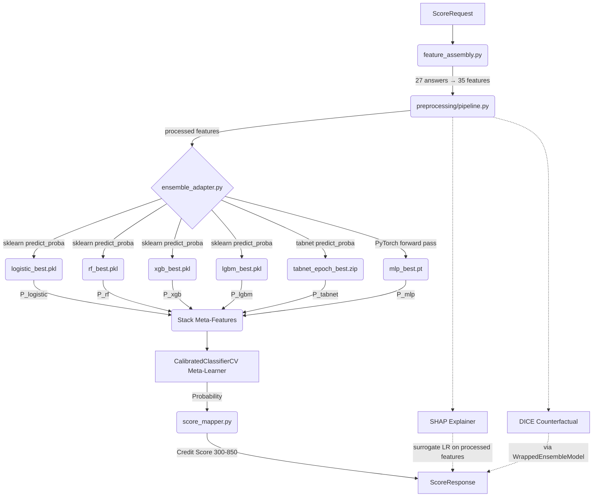

# Backend Runtime Architecture

This document explains the current backend architecture decisions that a frontend or deployment developer must understand before modifying any backend code.

## Active Runtime Model: Calibrated Stacking Ensemble

The `production_manifest.json` points to `stacking_ensemble` (v0.2.0) as the active runtime model. This is a calibrated stacking ensemble built from 6 base models:

| Base Model | Artifact | Inference Path |
|---|---|---|
| Logistic Regression | `logistic_best.pkl` | sklearn `predict_proba` |
| Random Forest | `rf_best.pkl` | sklearn `predict_proba` |
| XGBoost | `xgb_best.pkl` | sklearn `predict_proba` |
| LightGBM | `lgbm_best.pkl` | sklearn `predict_proba` |
| TabNet | `tabnet_epoch_best.zip` | pytorch-tabnet `predict_proba` |
| Residual MLP | `mlp_best.pt` | PyTorch forward pass |

The meta-learner is a `LogisticRegression(C=1.0)` wrapped in `CalibratedClassifierCV(method='isotonic', cv='prefit')`.

## Ensemble Inference Path



### Key Components

- **`backend/ml/inference/ensemble_adapter.py`** — Orchestrates the multi-model inference. `EnsembleInferenceBundle` holds all loaded models. `predict_ensemble_proba()` runs the full pipeline. `WrappedEnsembleModel` exposes a standard `predict_proba(processed_35)` API for DICE.
- **`backend/app/core/artifact_loader.py`** — Loads the manifest, validates checksums, and when `runtime_model_type == "ensemble"`, loads all 6 base models plus the stacking config.
- **`backend/app/services/scoring.py`** — Detects ensemble bundles in `__init__`, builds `EnsembleInferenceBundle`, and routes `_predict_repayment_probability` through the adapter.

## Systems That Are Stable And Should Not Be Casually Modified

| System | Path | Why It's Frozen |
|---|---|---|
| Manifest loader | `backend/app/core/artifact_loader.py` | Checksum verification, ensemble loading, 6+ integration tests |
| Ensemble adapter | `backend/ml/inference/ensemble_adapter.py` | Core inference path, 5 unit tests |
| Scoring service | `backend/app/services/scoring.py` | Tested E2E with checked-in ensemble bundle |
| Feature assembly | `backend/ml/inference/feature_assembly.py` | Canonical 35-feature pipeline, 4 integration tests |
| Preprocessing pipeline | `backend/ml/preprocessing/pipeline.py` | Train-fitted preprocessor + text PCA, serialized artifacts depend on it |
| Feature registry | `backend/ml/features/feature_registry.py` | 35 features, 6 unit tests, every other system depends on this |
| Analytics service | `backend/app/services/analytics.py` | Report-backed, 12 analytics endpoint tests |
| Health route | `backend/app/api/v1/routes/health.py` | Manifest-backed health reporting |
| Production manifest | `models/registry/production_manifest.json` | SHA256-verified, 18 artifact checksums |

**Rule:** If you need to change any of these files, run the full test suite first (`pytest tests/ -v`) and verify all 145 tests pass before AND after your change.

## Artifact / Manifest Relationships

```
production_manifest.json
 ├── runtime_model      → models/artifacts/calibrated_stacking.pkl
 ├── preprocessor       → models/preprocessors/preprocessor.pkl
 ├── text_pca           → models/preprocessors/text_pca.pkl
 ├── shap_explainer     → models/explainers/shap_explainer.pkl
 ├── dice_explainer     → models/explainers/dice_explainer.pkl
 ├── metrics            → models/reports/metrics.json
 ├── baseline_metrics   → models/reports/baseline_metrics.json
 ├── fairness_report    → models/reports/fairness_report.json
 ├── psi_report         → models/reports/psi_report.json
 ├── global_importance  → models/reports/global_importance.json
 ├── population_percentiles → models/reports/population_percentiles.json
 ├── base_models
 │    ├── logistic_regression → models/artifacts/logistic_best.pkl
 │    ├── random_forest       → models/artifacts/rf_best.pkl
 │    ├── xgboost             → models/artifacts/xgb_best.pkl
 │    ├── lightgbm            → models/artifacts/lgbm_best.pkl
 │    ├── tabnet              → models/artifacts/tabnet_epoch_best.zip
 │    └── residual_mlp        → models/artifacts/mlp_best.pt
 └── stacking_config    → models/artifacts/calibrated_stacking_config.json
```

Each artifact has a SHA256 checksum in the manifest. At startup, the backend:
1. Loads and parses the manifest
2. Verifies each artifact's checksum against the file on disk
3. Loads and validates each artifact (deserialize, type check, feature count)
4. When `runtime_model_type == "ensemble"`, loads all 6 base models and stacking config
5. Reports loaded/missing/invalid artifacts in `/api/health`

If any **scoring-critical** artifact (model, preprocessor) fails validation, the backend refuses to score and returns `503`.

## Explainability / Runtime Dependencies

| Artifact | Purpose | Runtime Dependency |
|---|---|---|
| `shap_explainer.pkl` | Per-user SHAP explanations in `/api/score` | Optional — score works without it, but `explanation` array is empty |
| `dice_explainer.pkl` | Counterfactual improvement actions in `/api/score` | Optional — DICE uses `WrappedEnsembleModel` to simulate actions through the full ensemble |
| `global_importance.json` | Dashboard feature importance | Read-only by `/api/global-importance` |
| `fairness_report.json` | Dashboard fairness audit | Read-only by `/api/fairness-report` |
| `psi_report.json` | Dashboard drift report | Read-only by `/api/drift-report` |

## Environment / Version Constraints

| Component | Version | Notes |
|---|---|---|
| Python | ≥3.10 | Tested on 3.14.3 |
| scikit-learn | ≥1.8.0 | Required — artifacts are serialized with this version |
| pytorch-tabnet | 4.1.0 | Required for serving (base model loading) |
| PyTorch | ≥2.0 | Required for serving (MLP and TabNet base model loading) |
| Node.js | ≥18 | Frontend build |
| Vite | ≥5.0 | Frontend dev server |
| React | ≥18 | Frontend framework |

The backend `requirements.txt` pins all ML dependencies. The frontend `package.json` pins all JS dependencies. Do not upgrade either without running the full test suite.
