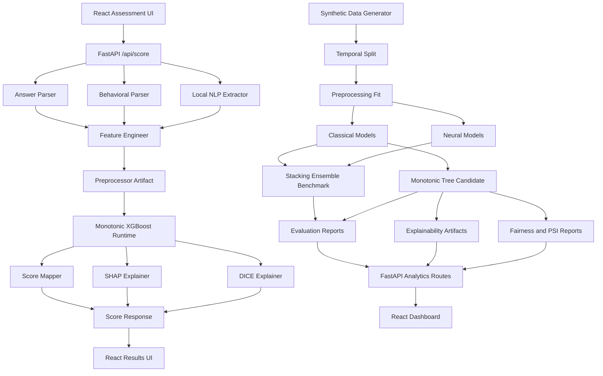

# AlterScore Engineering Context

## Purpose

This document is the durable engineering memory for AlterScore. It is written for human engineers, Codex, and other AI coding assistants that may work on this repository across sessions.

AlterScore is an alternative credit scoring platform for unbanked and thin-file borrowers. It uses psychometric assessment answers, behavioral telemetry, and local NLP features to produce a calibrated credit score, explanations, counterfactual improvement actions, and evaluator analytics.

## Mandatory AI Workflow

Before any AI agent edits the repository, it must read and follow `docs/AI_WORKFLOW_RULES.md`. That file defines the startup protocol, documentation update rules, testing expectations, git discipline, and session close procedure.

## Non-Negotiable PRD Intent

- No external LLM API is required for the product path. NLP must run locally through HuggingFace sentence-transformers, VADER, and spaCy.
- The project must include the full offline training pipeline, not only inference.
- The scoring model must use psychometric and behavioral signals, not bank history or traditional bureau history.
- Protected attributes are collected only for fairness analysis and must never be model inputs.
- Final validation must use a temporal cohort split: months 1-8 train, months 9-10 validation/calibration, months 11-12 test.
- The original PRD production target was a calibrated stacking ensemble; the active checked-in runtime has since been superseded by a governed monotonic `XGBoost` manifest bundle after constrained-tree governance review.
- Explainability must include per-user SHAP explanations and DICE-ML counterfactual improvement actions.
- Fairness must include demographic parity, equalized odds, calibration parity, and an individual-fairness proxy across gender, age group, region, and education level.
- The frontend must include assessment, results, score sharing, and evaluator dashboard workflows.

## PRD Analysis Summary

### System Modules

| Module | Responsibility | Primary Outputs |
|---|---|---|
| Assessment UI | Collect 27 question answers and behavioral telemetry | `ScoreRequest` payload |
| Feature Engineering | Convert raw answers, telemetry, and text into model-ready features | Model feature row |
| Local NLP | Extract sentiment, agency, problem-solving, and semantic PCA features from Q27 | NLP feature columns |
| Data Generation | Produce 10,000 synthetic records with realistic correlations, demographics, labels, and cohort month | `synthetic_dataset.csv` |
| Training | Train baselines, classical models, neural models, stacking ensemble, and calibrated production model | Model artifacts |
| Evaluation | Compute AUC, PR AUC, KS, Brier, ECE, confusion matrix, lift, calibration curves | Metrics reports |
| Explainability | Build global SHAP importance, per-user SHAP factors, and DICE counterfactual actions | Explanation artifacts |
| Fairness | Audit protected groups after prediction without using protected attributes as inputs | `fairness_report.json` |
| Drift | Compare train months against future test months with PSI | `psi_report.json` |
| Backend API | Serve scoring and analytics endpoints through FastAPI | `/api/*` responses |
| Frontend Dashboard | Render model, fairness, drift, score distribution, ROC, PR, calibration, and baseline analytics | Evaluator dashboard |
| Deployment | Package backend, frontend, model artifacts, and runtime configuration | Local/cloud deployable service |
| Testing | Validate data, ML, API, frontend, explainability, fairness, and deployment gates | Test suite and QA evidence |

### Backend Components

- FastAPI application with startup artifact loading, health checks, CORS, and route inclusion.
- API route modules for scoring and analytics.
- Pydantic v2 schemas for request and response contracts.
- Inference service that loads a single artifact bundle once at startup.
- Analytics service that reads metrics and reports generated by offline jobs.
- Request logging service with append-only JSONL prediction logs.
- Configuration and path management using `pathlib` and environment variables.

### ML Pipeline Components

- Synthetic data generator with correlated psychometric features, temporal cohort months, demographics, controlled default rate, and validation checks.
- Answer parser that maps raw assessment responses into psychometric feature scores.
- Feature engineer for derived features.
- Local NLP extractor using VADER, spaCy, and sentence-transformers.
- Preprocessing pipeline with scaling, imputation, ordinal/categorical encoding, and saved `ColumnTransformer`.
- Classical training: logistic regression, random forest, XGBoost, LightGBM, Optuna tuning where appropriate.
- Neural training: TabNet (`backend/ml/training/neural/train_tabnet.py`, `.zip` artifacts, 6/6 smoke tests) and residual MLP (`backend/ml/training/neural/train_mlp.py`, `.pt` checkpoints, 6/6 smoke tests) are both implemented. Track B (neural) is complete.
- Ensemble training: calibrated stacking ensemble (`backend/ml/training/ensemble/train_stacking.py`) is implemented and remains available as benchmark and rollback/reference infrastructure.
- Governed constrained-tree runtime: monotonic `XGBoost` is now the active checked-in manifest runtime (`xgboost_monotonic_v1`) after monotonic, counterfactual, and fairness-focused governance review.
- Metrics computation and artifact export.
- SHAP explainer creation and global importance report generation.
- DICE-style counterfactual explainer creation with immutable/protected feature exclusions; the checked-in local bundle currently persists a lightweight validated monotonic counterfactual artifact at `models/explainers/dice_explainer_monotonic.pkl`.
- Fairness audit and PSI drift report generation.

### Frontend Components

- Landing page for product entry.
- Assessment page with 27-question flow, section transitions, progress, validation, telemetry capture, and resilient submit retry.
- Results page with score gauge, risk band, percentile, eligibility, SHAP factor bars, DICE actions, improvement tips, and WhatsApp-shareable card export.
- Dashboard page consumes most report-backed analytics endpoints; confusion-matrix rendering, independent panel states, and browser QA remain Track F work.
- Shared hooks/services currently cover API requests, score payload construction, scroll observation, Lenis, and magnetic-button interactions.

### Data Pipeline Requirements

- Generate 10,000 synthetic applicants.
- Preserve realistic feature correlations rather than independent random columns.
- Include `cohort_month` and optional `application_date` for temporal validation only.
- Apply train/validation/test by cohort month, never random split for final metrics.
- Maintain separate protected attributes.
- Exclude `cohort_month`, `application_date`, and protected attributes from `NUMERIC_FEATURES` and `CATEGORICAL_FEATURES`.
- Save validation reports before training begins.
- Persist all generated artifacts with deterministic seeds and run metadata.

### Deployment Requirements

- Local development must run backend and frontend independently.
- Backend must load the production artifact bundle at startup and fail clearly if required artifacts are missing.
- Frontend must use a configurable API base URL.
- Heavy model artifacts and generated data are not source-controlled by default; the curated small local runtime bundle checked into `models/` is the approved portability exception for backend smoke coverage.
- Deployment must include model artifact promotion, health checks, structured logs, and rollback guidance.
- Cloud deployment can come after local reproducibility and artifact stability.

### Explainability Modules

- Global feature importance: SHAP mean absolute values, top features, and summary plot.
- Per-user explanation: top 6 SHAP factors with direction, value, display name, and contribution.
- Counterfactual actions: the checked-in local runtime bundle uses a persisted `dice_explainer_monotonic.pkl` artifact that emits bounded actionable suggestions through the active runtime path. Ensemble bundles still use `WrappedEnsembleModel` when intentionally loaded.
- Plain-language tip generation mapped from negative or weak factors.

### Runtime Serving Architecture (Tracks D+ And D++)

- The active serving runtime is monotonic `XGBoost`.
- The scoring service assembles 35 canonical features, applies the saved monotonic preprocessor, calls the active runtime model, applies the bounded governance multiplier, and maps repayment probability into a 300-850 score.
- The calibrated stacking ensemble adapter remains implemented for reference/rollback manifests that declare `runtime_model_type: "ensemble"`.
- The manifest schema validates checksums before scoring.
- The SHAP and DICE artifacts are runtime-specific and currently use the monotonic artifact variants.
- See `docs/BACKEND_RUNTIME_ARCHITECTURE.md` for the current runtime details.

### Fairness Modules

- Demographic parity by protected group.
- Equalized odds through false positive and false negative rates.
- Calibration parity through grouped calibration curves.
- Individual fairness proxy using full-profile similar pairs with demographic differences.
- Fairness report with green/yellow/red flags, sample-size guards, and final verdict.

### Analytics Dashboard Modules

- Production model comparison table.
- Baseline comparison table including simulated loan officer.
- Feature importance chart.
- ROC and PR curves.
- Score distribution histogram with band thresholds.
- Calibration curve.
- PSI drift monitor.
- Fairness audit tables.
- Confusion matrix and optional data inspector.

### Testing Requirements

- Data validation tests for missing values, range checks, temporal split integrity, protected attribute separation, target default rate, and feature-label correlation.
- ML tests for probability shape/range, monotonic score mapping, calibration quality, model comparison, ensemble lift, SHAP non-triviality, DICE action validity, and PSI non-negativity.
- API tests for health, score, analytics endpoints, schema validation, and edge-case payloads.
- Frontend tests for assessment completion, responsive behavior, result rendering, dashboard fetch states, and error recovery.
- E2E tests for full assessment-to-result flow and dashboard loading.

### Documentation Requirements

- Every architecture decision belongs in `docs/DECISIONS.md`.
- Every schema-affecting change updates `docs/API_CONTRACTS.md` and `docs/DATA_SCHEMA.md`.
- Every model artifact change updates `docs/MODEL_REGISTRY.md`.
- Every experiment run updates `docs/EXPERIMENT_LOG.md`.
- Every milestone and implementation state change updates `docs/CURRENT_STATE.md`, `docs/ROADMAP.md`, and `docs/TODO.md`.
- Every release or environment change updates `docs/DEPLOYMENT.md`.

## High-Level Architecture



## Component Dependency Graph

| Component | Depends On | Blocks |
|---|---|---|
| Documentation and contracts | PRD | All implementation |
| Feature registry | PRD feature definitions | Data generation, preprocessing, API parser |
| API contracts | PRD endpoint spec, feature registry | Frontend integration, backend route tests |
| Data generator | Feature registry, protected attribute schema, temporal split rules | Training, fairness, drift, dashboard data |
| Data validation | Data generator, schema | Training readiness |
| NLP extractor | Local model dependencies, text feature schema | Data generation text features, inference |
| Derived feature engineer | Base features, behavioral features, NLP features | Preprocessing, inference |
| Preprocessor | Feature registry, train split | All model training and inference |
| Baselines | Data split, preprocessor | Model comparison dashboard |
| Classical models | Data split, preprocessor, baselines | Stacking benchmark, monotonic tree runtime, explainability |
| Neural models | Data split, preprocessor, GPU setup | Stacking benchmark |
| Stacking ensemble | Classical and neural base models | Benchmarking, rollback/reference runtime |
| Monotonic tree runtime | Classical feature policy, governance gates | Production inference |
| Calibration | Validation split, candidate model | Score mapping, metrics, API response reliability |
| Explainability | Trained RF/production model, preprocessor | Results page, dashboard |
| Counterfactuals | Production model, DICE data interface, actionable feature list | Results page |
| Evaluation | All models, calibrated model, test split | Analytics endpoints |
| Drift report | Train/test feature distributions | Dashboard drift panel |
| Fairness report | Test predictions, protected attributes | Dashboard fairness panel |
| Backend API | Artifacts, contracts | Frontend development |
| Frontend UI | API contracts, design system | E2E demo |
| Deployment | Passing tests, artifact bundle, environment config | Production demo |

## Recommended Development Order

1. Stabilize documentation, contracts, repository layout, and feature registry.
2. Implement shared configuration, constants, schemas, and path conventions.
3. Implement synthetic data generation and validation.
4. Implement local NLP extraction and fit text PCA only on training data.
5. Implement derived feature engineering and preprocessing.
6. Train baselines and classical models.
7. Train neural models once classical pipeline is reliable.
8. Train stacking ensemble as a benchmark/reference path, then evaluate governed monotonic tree candidates.
9. Freeze the selected manifest runtime and generate explainability, counterfactual, fairness, drift, and metrics reports.
10. Build FastAPI scoring and analytics endpoints against fixed contracts.
11. Build frontend assessment and result flow.
12. Build dashboard only after analytics reports and endpoints are stable.
13. Add deployment packaging, monitoring, and release documentation.

## Repository Structure

```text
AlterScore/
  backend/
    app/
      api/v1/routes/          FastAPI route modules
      core/                   Settings, paths, startup, CORS, artifact loading
      schemas/                Pydantic API request/response models
      services/               Scoring, analytics, logging, artifact access
    ml/
      data_generation/        Synthetic data generation and validation
      features/               Answer parsing and derived feature engineering
      nlp/                    Local NLP feature extraction and text PCA support
      preprocessing/          Feature registry and preprocessing pipelines
      training/
        classical/            Logistic, RF, XGBoost, LightGBM
        neural/               TabNet and MLP
        ensemble/             Stacking and calibration
      inference/              Runtime feature assembly and score mapping
      evaluation/             Metrics, curves, baselines, confusion matrices
      explainability/         SHAP and DICE generation
      registry/               Artifact metadata helpers
  data/
    raw/                      Raw or generated source data
    interim/                  Intermediate transformation outputs
    processed/                Model-ready datasets
    validation/               Data validation outputs
    reports/                  Data profile reports
  models/
    artifacts/                Trained model binaries
    preprocessors/            Encoders, scalers, PCA
    explainers/               SHAP and DICE artifacts
    reports/                  Metrics, fairness, PSI, importance, curves
    registry/                 Model registry metadata
  experiments/
    runs/                     Run outputs and summaries
    optuna/                   Optuna studies
  frontend/
    src/
      pages/                  Landing, Assessment, Results, Dashboard
      components/assessment/  Assessment-specific components
      components/results/     Results-specific components
      hooks/                  React hooks
      services/               API client and score payload helpers
      data/                   Question definitions and constants
      styles/                 Global styles and Tailwind entry
  scripts/
    data/                     Data generation commands
    training/                 Training orchestration commands
  deploy/
    cloud/                   Cloud deployment scaffolding
    monitoring/              Monitoring scaffolding
  runtime/
    logs/                     Local append-only runtime logs
    pytest-cache/             Workspace-local pytest cache output
    pytest-workspace/         Workspace-local temp root for tests
  tests/
    unit/backend/             Backend unit tests
    unit/ml/                  ML unit tests
    integration/api/          API integration tests
    integration/pipeline/     Data/training pipeline tests
    fixtures/                 Test payloads and small fixtures
  docs/
    context_templates/        AI handoff and session templates
```

## Naming Conventions

### Python

- Files and modules: `snake_case.py`.
- Functions and variables: `snake_case`.
- Classes and Pydantic models: `PascalCase`.
- Constants: `UPPER_SNAKE_CASE`.
- Training entrypoints: verb-first names such as `train_random_forest.py`, `build_fairness_report.py`.
- Artifact paths are resolved from central settings, not hardcoded strings.

### JavaScript and React

- React components: `PascalCase.jsx`.
- Hooks: `useThing.js`.
- Utilities: `camelCase.js` or domain-specific `snake-like` avoided.
- Constants: `UPPER_SNAKE_CASE`.
- Route-level pages live in `frontend/src/pages`.

### Artifacts

- Model artifact names: `{model_family}_{stage}_{version}.{ext}` where useful, for example `stacking_calibrated_v0.1.0.pkl`.
- Report names: `{report_type}_{dataset_split}_{run_id}.json` for experiment outputs, with stable aliases for production, for example `metrics.json`.
- Experiment run IDs: `YYYYMMDD_HHMMSS_shortslug`.

### Branches and Commits

- Branch prefix: `codex/` for AI-authored task branches unless the user requests another prefix.
- Branch name format: `codex/<scope>-<short-task>`.
- Commit style: Conventional Commits, for example `docs: scaffold engineering context`.

## File Organization Rules

- Do not place training code inside API route modules.
- Do not place inference-only code inside notebooks.
- Do not import frontend question scoring as the backend source of truth; backend parsing must independently enforce scoring logic.
- Do not read protected attributes from runtime score requests for model inference.
- Do not store generated datasets or trained binary artifacts in Git unless explicitly approved. The curated small local runtime bundle in `models/` is the current approved exception.
- Keep reports as JSON for backend consumption and Markdown for human context.
- Keep long-lived architecture knowledge in `docs/`, not scattered across chat history.

## Context Engineering System

### Operating Principles

- Every AI session starts by reading `docs/AI_WORKFLOW_RULES.md`, `docs/ENGINEERING_CONTEXT.md`, `docs/CURRENT_STATE.md`, `docs/TODO.md`, and the task-specific doc.
- Every task must identify owned files before editing.
- Every task ends with a session summary that states files changed, tests run, decisions made, blockers, and next step.
- Architecture changes require an entry in `docs/DECISIONS.md`.
- Model or data changes require updates to `docs/DATA_SCHEMA.md`, `docs/MODEL_REGISTRY.md`, and `docs/EXPERIMENT_LOG.md`.

### Reusable Templates

The complete templates live in `docs/context_templates/`:

- `AI_ONBOARDING_TEMPLATE.md`
- `TASK_HANDOFF_TEMPLATE.md`
- `BUG_REPORT_TEMPLATE.md`
- `EXPERIMENT_LOGGING_TEMPLATE.md`
- `FEATURE_IMPLEMENTATION_TEMPLATE.md`
- `SESSION_SUMMARY_TEMPLATE.md`

## Strict Engineering Rules

### Architecture Rules

- Preserve the separation between offline ML training and online inference.
- Preserve the separation between protected audit attributes and model input features.
- Use contracts and schemas before implementation.
- Use small modules with one responsibility.
- Shared constants must live in one backend source of truth and be imported by training and inference.

### API Versioning

- External PRD-compatible routes use `/api/...`.
- Internal route organization may use `api/v1`, but public compatibility with the PRD route list must be maintained until a formal decision changes it.
- Breaking response changes require versioning and documentation updates.

### Model Versioning

- Every promoted model requires a registry entry, training config, dataset version, metrics, fairness report, drift report, and artifact checksums.
- A model cannot be promoted if it fails temporal split evaluation or uses protected attributes as inputs.

### Experiment Tracking

- Every non-trivial training run gets an experiment log entry before results are used in decisions.
- Optuna studies must be persisted with seed, search space, metric, and best params.

### Dependency Management

- Backend dependencies are pinned.
- Frontend dependencies are locked.
- Heavy ML dependencies are documented separately if local install time or GPU compatibility is sensitive.

### Testing Policy

- Schema and feature tests come before model training tests.
- No dashboard work is considered complete until the corresponding backend endpoint has contract tests.
- ML changes must include deterministic seed handling and a small smoke-test path.

### Documentation Update Policy

- Any change to architecture, data schema, API contract, artifact names, or development order must update docs in the same task.
