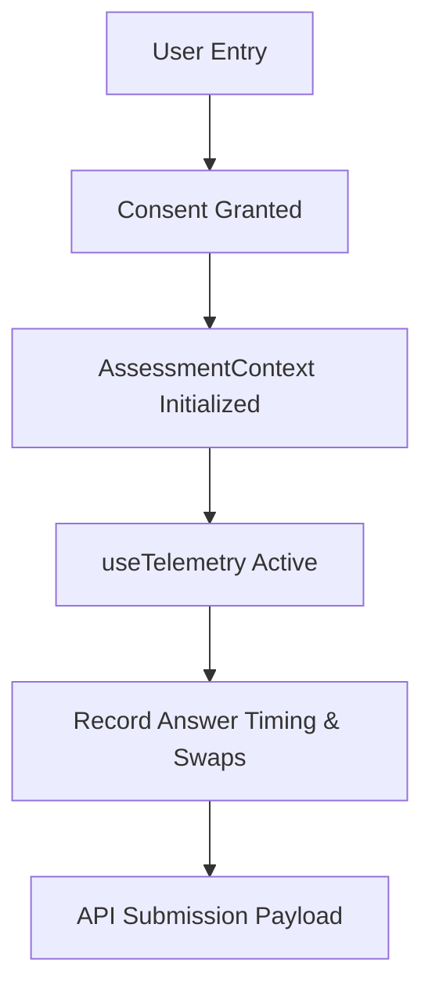

# AlterScore: Frontend Architecture Blueprint

This document defines the frontend client architecture for AlterScore, detailing routing layouts, modular component design, the global state layer, telemetry collection boundaries, and backend service integration.

---

## 1. Modular Directory Organization

To prepare the application for scale and separate concerns between user assessment views and evaluator analytics HUDs, we recommend organizing the frontend codebase as follows:

```
frontend/src/
├── components/
│   ├── assessment/         # Form controls, option cards, progress indicators
│   ├── results/            # Score reveal, SHAP charts, counterfactual toggles
│   ├── dashboard/          # Performance charts, fairness audits, drift monitors
│   ├── ui/                 # Reusable layout shells, glitch text, grain overlays
│   └── common/             # Navbars, footers, loader screens, error boundaries
├── context/
│   └── AssessmentContext.jsx # Shared global context for user progress and inputs
├── hooks/
│   ├── useTelemetry.js     # Unified telemetry trackers (scroll, click, tab swaps)
│   ├── useMagnetic.js      # Magnetic micro-animation hooks
│   └── useObserver.js      # Scroll observer hooks
├── pages/
│   ├── Landing.jsx         # Entrypoint & manifesto view
│   ├── Assessment.jsx      # Guided multi-step psychometric test
│   ├── Results.jsx         # Credit score & explainability dashboard
│   └── Dashboard.jsx       # Risk Analyst & Model Governance Center
├── services/
│   ├── api.js              # Fetch client wrappers for backend API routes
│   └── scorePayload.js     # Payload parser, rounding, and WPM calculators
└── styles/
    └── index.css           # Design token registers & base typography styles
```

---

## 2. Shared Layout Shell (`TacticalLayout`)

The client layout uses a unified shell wrapper, [TacticalLayout.jsx](file:///c:/Kaustubh/Projects/AlterScore/frontend/src/components/layout/TacticalLayout.jsx), to establish design continuity:
* **Background Atmosphere**: Ambient vignette layers and a CSS grain overlay mimic a premium, research-grade HUD terminal.
* **Scroll Optimization**: Uses Lenis smooth scroll controls to ensure micro-interactions feel natural and viewport scrolling behaves predictably on all screen dimensions.
* **Component Lazy-Loading**: Route rendering uses React Suspense to isolate page modules and prevent heavy chart components (like Recharts in the admin dashboard) from impacting initial landing bundle speeds.

---

## 3. State Management & Telemetry Hook Model



### Global Session Management (`AssessmentContext`)
To replace ad-hoc `sessionStorage` updates in individual components, a unified `AssessmentContext` manages:
1. **Answers Object**: Map of `questionId` to raw coerced numerical/text selections.
2. **Telemetry State**: 
   * `responseTimes`: Timestamps of user activity per question card.
   * `changeCounts`: Modification counts per question.
   * `scrollHesitations`: Trackers for direction changes per question.
   * `dropoutCount`: Increments on browser window defocus.
3. **Pacing Indicators**: Session initialization timestamp (`sessionStartTime`) for final duration calculations.

### Unified Hook (`useTelemetry`)
The `useTelemetry` custom hook encapsulates browser event listeners:
* **Defocus Tracking**: Listens to `visibilitychange`. If `document.hidden` is true, increments `dropoutCount`.
* **Direction Tracking**: Listens to passive viewport scrolling, matching vertical coordinates against the last known scroll positions to count hesitations.
* **Pacing Audits**: Resets page timers when a user transitions to a new question card.

---

## 4. API Service Integration Layer

All client requests interface through a standardized service layer in [api.js](file:///c:/Kaustubh/Projects/AlterScore/frontend/src/services/api.js).

| Client Page / Tab | API Service Function | Endpoint Route | Schema Payload |
| :--- | :--- | :--- | :--- |
| **Applicant Submit** | `submitScore(payload)` | `/api/v1/score` | `ScoreRequest` / `ScoreResponse` |
| **Dashboard HUD** | `fetchHealth()` | `/api/v1/health` | System status manifest data |
| **Performance Tab** | `fetchModelStats()` | `/api/v1/model/stats` | AUC-ROC / F1 metrics |
| **Performance Curves** | `fetchRocData()`, `fetchPrCurve()` | `/api/v1/model/curves` | FPR/TPR arrays for plotting |
| **Drift Monitoring** | `fetchDriftReport()` | `/api/v1/model/drift` | PSI scores per feature |
| **Fairness Audit** | `fetchFairnessReport()` | `/api/v1/model/fairness` | Disparate impact metrics per group |
| **Scoring Distribution**| `fetchScoreDistribution()` | `/api/v1/model/distribution` | Frequency bins for histogram plot |

---

## 5. Loading, Error, and Boundary Isolation

1. **Boundary Isolation**: Route routing is wrapped in [ErrorBoundary.jsx](file:///c:/Kaustubh/Projects/AlterScore/frontend/src/components/common/ErrorBoundary.jsx) to prevent model rendering failures from crashing the client shell.
2. **Loading States**: Submitting answers to `/score` triggers the `ProcessingScreen` which shows structured status tickers ("Running fairness proxy audits...", "Computing SHAP metrics...") to manage the 5-second backend compute latency smoothly.
3. **Resilience & Retry**: If submission fails (e.g. network dropout), the client retains the current answers in `sessionStorage` and exposes a clear retry action button using the same payload session ID to avoid data loss.
