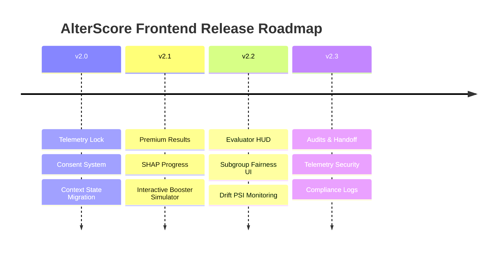
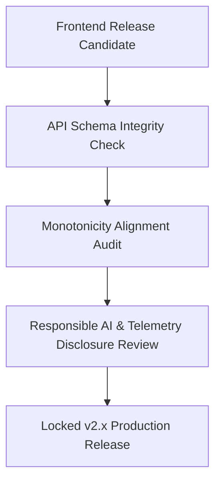

# AlterScore: Frontend Productization Roadmap

This document outlines the productization strategy and release roadmap for the AlterScore frontend client, transitioning the platform from an experimental psychometric scoring interface to a production-grade, governed behavioral credit scoring system.

---

## 1. Product Identity & Goals

AlterScore is a **governed behavioral credit-scoring platform for unbanked users**. It is designed to be:
* **Trustworthy**: Explains *why* decisions are made and *how* data is handled.
* **Explainable**: Visualizes mathematical contribution scores (SHAP) in human-centric language.
* **Governance-aware**: Audits itself against fairness metrics and exhibits locked compliance metrics.
* **Psychologically Safe**: Respects user attention, avoids cognitive overload, and provides clear pathways for score improvement.

### Core Release Objectives
1. **Productize the Onboarding Experience**: Shift the assessment from a generic form to a premium, guided psychometric interview.
2. **Empower Evaluators**: Standardize the monitoring interface to display global model drift (PSI) and subgroup fairness validation (disparate impact) alongside direct client logs.
3. **Auditability & Handoff**: Bridge the gap between algorithmic code and institutional compliance requirements.

---

## 2. Chronological Milestones (v2.x)

### Milestone 1: v2.0 "Foundational Telemetry & State Lock"
* **Objective**: Stabilize data collection, establish strict security consent, and clean up technical debt in layout rendering.
* **Key Features**:
  * Implement unified React Context (`AssessmentContext`) for session state management.
  * Launch explicit Telemetry Consent overlay (opt-in/opt-out behavior).
  * Build viewport-adaptive layout structures to capture accurate device context (`device_type`).
* **Success Criteria**:
  * 100% of telemetry payloads validate against Pydantic schema contracts without API 422 errors.
  * Zero session loss during accidental refreshes.

### Milestone 2: v2.1 "Premium Results & Interactive Explainability"
* **Objective**: Transform the score reveal into an educational, trust-building experience.
* **Key Features**:
  * Build the progressive disclosure reveal animation for credit scores (300-850 scale).
  * Redesign SHAP contribution visualizers using styled human-centric impact bars.
  * Create the **Interactive Counterfactual Booster Simulator**, allowing users to toggle checkboxes for recommended habits and watch their simulated score gain change dynamically.
* **Success Criteria**:
  * User comprehension testing shows $>85\%$ accuracy in identifying why their score was designated in a specific risk band.

### Milestone 3: v2.2 "Evaluator HUD & Subgroup Fairness UI"
* **Objective**: Expose the governance controls, group disparities, and statistical health of the system to risk analysts.
* **Key Features**:
  * Complete the Evaluator/Admin Dashboard split.
  * Implement group fairness breakdowns (disparate impact indicators, AUC metrics per subgroup).
  * Integrate PSI (Population Stability Index) alerts to identify data drift.
  * Plot diagnostic curves (ROC, Precision-Recall, Calibration) using unified color-tokens in Recharts.
* **Success Criteria**:
  * Risk managers can successfully locate worst-performing protected proxy groups and view drift warnings in under 3 clicks.

### Milestone 4: v2.3 "Governance Compliance & Telemetry Security"
* **Objective**: Establish the defensive security layer and audit logs to prevent gaming and ensure responsible AI.
* **Key Features**:
  * Build the **Pacing Anomaly Indicator** on the evaluator dashboard (identifies copy-paste text injections, under-1000ms click habits).
  * Create print-friendly, verifiable score certificates (PDF export with SHA-256 signatures of model manifests).
  * Implement a plain-language **Responsible AI Manifest** modal for applicants.
* **Success Criteria**:
  * System detects 100% of simulated gaming attempts (such as the "Manipulated Persona") and highlights warning flags in the admin HUD.

---

## 3. Product Validation & Compliance Protocol

Before any major version release is certified for staging, it must pass a three-tiered validation checklist:

1. **API Schema Integrity**: Verify that frontend telemetry payloads exactly map to backend specifications (`avg_response_time_ms`, `answer_change_rate`, `scroll_hesitation_score`, `risk_response_speed_ratio`).
2. **Monotonicity Alignment**: Ensure that SHAP explanation items match the sign of SHAP output values from the backend, confirming that positive contributions are always labeled as score enhancers.
3. **Responsible AI Disclosure**: Confirm that the telemetry opt-in overlay provides clear plain-language descriptions of collected metrics and respects user choices on mobile/desktop clients.
